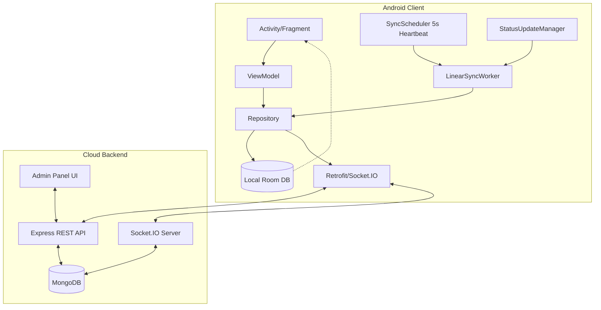

# MasterChat Architecture: Comprehensive System Design

## 1. Executive Summary
MasterChat is a high-performance, **Offline-First**, eventually consistent communication platform. It utilizes a hybrid architecture of REST for reliable bulk synchronization and Socket.IO for low-latency real-time events. The system is designed to handle flaky network conditions, guarantee message ordering, and provide a seamless "fast UI" experience through optimistic updates and a high-frequency background heartbeat.

---

## 2. High-Level Design (HLD)

### 2.1 The "Gold Source" Pattern
The system follows a strict hierarchy for the "Source of Truth":
1.  **Local SQLite (Room)**: The primary source of truth for the UI. No network calls block the rendering of messages.
2.  **Server (MongoDB)**: The final arbiter of global ordering. It assigns monotonic `sequenceId`s and `updatedAt` timestamps to resolve temporal conflicts and synchronization gaps.

### 2.2 System Components

---

## 3. Low-Level Design (LLD)

### 3.1 Data Flow: Sending a Message (Upstream)
1.  **Optimistic UI Update**: `MessageRepository` assigns a `msgUuid` and saves the message to Room with status `PENDING`. The UI updates instantly.
2.  **Outbox Pattern**: A `SyncQueueEntity` is created in the same database transaction.
3.  **Background Processing**: `SyncWorker` or `LinearSyncWorker` (triggered by `SyncScheduler`) reads the outbox, batches messages, and hits `POST /api/sync/messages`.
4.  **Server Finalization**: The server assigns a `sequenceId`, persists to MongoDB, and returns the confirmed metadata.
5.  **Confirmation**: The local message status is updated to `SENT` and the outbox entry is cleared.

### 3.2 Data Flow: Receiving & Synchronizing (Downstream)
1.  **High-Frequency Heartbeat**: `SyncScheduler` triggers a `LinearSyncWorker` cycle every **5 seconds**.
2.  **Differential Pull (Sequence & Time)**:
    *   **New Data**: The client requests messages `afterSequenceId = X`.
    *   **Updated Data (Edits/Status)**: The client requests messages `updatedAfter = T` (ISO 8601) using `lastPulledAt` from `SyncCheckpoint`.
3.  **Reconciliation Phase**: The client calls `GET /api/sync/reconcile-ids` to fetch the complete set of valid message UUIDs for a conversation. Local messages not present in the server's set (hard-deleted) are purged from Room.
4.  **Atomic Persistence**: Messages are upserted into Room. The LiveData observer automatically refreshes the `RecyclerView`.

---

## 4. Database Schema Design

### 4.1 Server (MongoDB)
| Field | Type | Description |
| :--- | :--- | :--- |
| `_id` / `msgUuid` | String (UUID) | Idempotency Key (Client-Generated) |
| `conversationId` | ObjectId | Reference to Conversation |
| `sequenceId` | Number (Long) | Monotonic counter per conversation |
| `status` | Enum | `sent`, `delivered`, `read` |
| `updatedAt` | Date | **Crucial**: Automatically updated on edits/status changes |

### 4.2 Client (Room SQLite)
- **Table: `messages`**
    - `msgUuid` (PK)
    - `sequenceId` (Indexed)
    - `status` (`PENDING`, `sent`, `delivered`, `read`, `FAILED`)
- **Table: `sync_checkpoints`**
    - `conversationId` (PK)
    - `lastPulledSeq`: Highest sequence pulled.
    - `lastPulledAt`: Highest timestamp pulled (for edits).
- **Table: `sync_queue`**: The Outbox for upstream creations/deletions.

---

## 5. Administrative Oversight & Control

### 5.1 Real-Time Admin Panel
MasterChat includes a state-of-the-art administrative dashboard (`/admin`) for data management:
*   **CRUD Operations**: Administrators can view and delete Users, Conversations, Messages, and Watermarks.
*   **Cascade Deletion**: Deleting a conversation automatically purges all related messages and watermarks from MongoDB.
*   **Instant Sync Trigger**: Deletions/Changes emit specialized socket events (`global_sync_required`, `message_deleted_from_admin`).

### 5.2 Background Reactivity
The Android client listens for Admin-initiated events via `StatusUpdateManager`:
*   **Targeted Purge**: When a single message is deleted via Admin, the client receives the ID and removes it locally without a full sync.
*   **Global Sync Request**: System-wide changes trigger an immediate out-of-band execution of the `LinearSyncWorker`.

---

## 6. Critical Problems & Optimized Solutions

### ✅ Problem 1: Catching Server-Side Edits
*   **Problem**: Differential pulling by `sequenceId` only finds *new* messages, missing edits or status updates to *old* messages.
*   **Solution**: **Dual-Pivot Sync**. The client tracks `lastPulledAt`. The API returns messages where `sequenceId > X OR updatedAt > T`. 

### ✅ Problem 2: Hard-Deleted Message Zombies
*   **Problem**: Messages deleted on the server leave "zombie" copies on offline clients.
*   **Solution**: **ID Reconciliation**. The sync worker performs a per-conversation "sanity check" by comparing local UUIDs against the server's active set and pruning orphans.

### ✅ Problem 3: Low-Latency Sync Backgrounding
*   **Problem**: Standard `WorkManager` periodic intervals (15m) are too slow for instant communication.
*   **Solution**: **Recursive Heartbeat Scheduler**. `SyncScheduler` implements a 5-second `OneTimeWorkRequest` chain that re-enqueues itself, ensuring the sync motor never stops.

### ✅ Problem 4: Orphaned Watermarks
*   **Problem**: Deleting conversations leaves useless read-receipt records in the DB.
*   **Solution**: **Server-Side Cleanup Middleware**. The admin deletion routes and the `GET /api/admin/all-data` route include logic to prune orphaned `ReadWatermark` entries.

---
